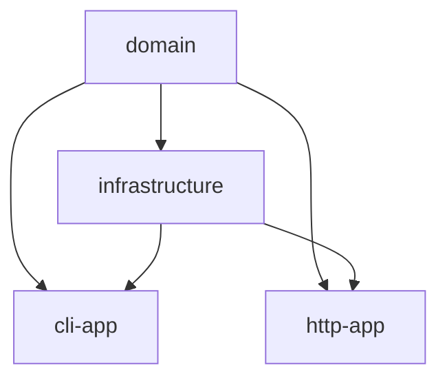

# Kotlin Cart Implementation - Event Sourcing Architecture

## Overview

This project implements a shopping cart functionality using event sourcing architecture in Kotlin. It demonstrates domain-driven design principles, test-driven development (TDD), and clean architecture patterns.

## Architecture

The project follows a multi-module architecture with clear separation of concerns:

```
📁 Project Structure
├── domain/          # Pure business logic (constitutional purity)
├── infrastructure/  # EventStore, repositories, technical implementations  
├── cli-app/        # Command-line application
└── http-app/       # HTTP API application (prepared for future implementation)
```

### Key Design Principles

- **Domain Purity**: Domain layer has zero external dependencies (Kotlin stdlib only)
- **Event Sourcing**: All state changes are captured as domain events
- **TDD Approach**: Tests written first, implementation follows (Red→Green→Refactor)
- **Constitutional Compliance**: Follows architectural constraints defined in project constitution

## Core Features

### ✅ Implemented Features

- **Cart Creation**: Automatically creates cart when first item is added
- **Item Management**: Add items with quantity tracking
- **Capacity Constraints**: Maximum 3 items total per cart
- **Optimistic Locking**: Concurrent modification detection via event versioning
- **Event Sourcing**: Complete audit trail of all cart operations
- **Value Objects**: Type-safe identifiers (ProductId, CartId, EventVersion)

### 🏗️ Technical Implementation

- **Domain Events**: `CartCreated`, `ItemAddedToCart`
- **Aggregates**: Cart aggregate root with LineItem entities
- **Commands**: `AddItemToCart` command handling
- **Event Store**: In-memory implementation with optimistic locking
- **Service Layer**: `CartService` orchestrates business operations

## Running the Demo

### Prerequisites

- Kotlin 1.9.25+
- Gradle 9.1.0+
- Java 11+

### Quick Start

```bash
# Clone and navigate to project
cd kotlin-experiment

# Run the interactive CLI demo
./gradlew :cli-app:run

# Run all tests
./gradlew test
```

### Expected CLI Output

```
🛒 Kotlin Cart Demo - Event Sourcing Implementation
==================================================
📦 Creating new cart and adding first item...
✅ Cart created: f3cddcbd-4efd-4c2d-aed9-c22c69934099
   Total items: 1
   Events generated: 2
   - CartCreated
   - ItemAddedToCart

📦 Adding second item to existing cart...
✅ Item added successfully!
   Total items: 2
   Line items: 2
   - laptop-123: quantity 1
   - mouse-456: quantity 1

📦 Attempting to add items that would exceed capacity...
❌ Expected failure: A cart cannot hold more than three (3) items.

📦 Adding one more item to reach capacity...
✅ Cart at capacity!
   Total items: 3
   At capacity: true
   - laptop-123: quantity 1
   - mouse-456: quantity 1
   - keyboard-789: quantity 1

🎉 Demo completed!
```

## Testing

The project includes comprehensive test coverage following TDD principles:

```bash
# Run all tests across modules
./gradlew test

# Run specific module tests
./gradlew :domain:test        # Domain logic tests
./gradlew :infrastructure:test # Infrastructure tests
./gradlew :cli-app:test       # CLI application tests
```

### Test Categories

- **Unit Tests**: Domain logic, value objects, entities
- **Integration Tests**: Event store, service layer
- **Contract Tests**: API contracts and behavior validation
- **Acceptance Tests**: End-to-end scenario validation

## Domain Model

### Key Entities

```kotlin
// Value Objects
@JvmInline value class ProductId(val value: String)
@JvmInline value class CartId(val value: String) 
@JvmInline value class EventVersion(val value: Long)

// Entities  
data class LineItem(val productId: ProductId, val quantity: Int)
data class Cart(val cartId: CartId, val lineItems: Map<ProductId, LineItem>, val version: EventVersion)

// Domain Events
data class CartCreated(val cartId: CartId, override val timestamp: Instant) : DomainEvent
data class ItemAddedToCart(val cartId: CartId, val productId: ProductId, val quantity: Int, val newTotalQuantity: Int) : DomainEvent
```

### Business Rules

1. **Cart Creation**: New cart created automatically when first item added
2. **Capacity Limit**: Maximum 3 items total across all line items  
3. **Quantity Aggregation**: Same product ID increments existing line item quantity
4. **Optimistic Locking**: Version-based concurrency control
5. **Event Immutability**: All state changes captured as immutable events

## Event Sourcing Implementation

The system uses event sourcing to maintain complete audit trails:

```kotlin
interface EventStore {
    fun append(aggregateId: String, expectedVersion: EventVersion, events: List<DomainEvent>): Result<Unit>
    fun getEvents(aggregateId: String): List<DomainEvent>
    fun getEvents(aggregateId: String, fromVersion: EventVersion): List<DomainEvent>
}
```

### Event Flow

1. **Command Reception**: `AddItemToCart` command received
2. **State Reconstruction**: Load cart from event stream
3. **Business Validation**: Check capacity constraints
4. **Event Generation**: Create domain events for state changes
5. **Event Persistence**: Append to event store with optimistic locking
6. **State Projection**: Build updated cart state from events

## Module Dependencies



- **Domain**: Pure business logic (no dependencies)
- **Infrastructure**: Technical implementations (depends on domain)
- **Applications**: User interfaces (depend on domain + infrastructure)

## Performance Characteristics

- **In-Memory Storage**: Fast read/write operations for development/testing
- **Linear Event Replay**: O(n) complexity for cart reconstruction  
- **Optimistic Locking**: Minimal locking overhead, handles concurrent access
- **Memory Usage**: Events retained in memory (suitable for bounded contexts)

## Future Enhancements

### Planned Improvements
- **HTTP API**: RESTful endpoints for web integration
- **Persistent Storage**: Database-backed event store  
- **Event Snapshots**: Performance optimization for large event streams
- **CQRS Integration**: Separate read models for queries
- **Event Replay**: Temporal queries and state reconstruction

### Architectural Extensions  
- **Message Bus**: Async event processing
- **Multi-tenancy**: Isolated cart contexts
- **API Gateway**: External service integration
- **Monitoring**: Event stream observability

## Development Guidelines

### Code Style
- Follow Kotlin coding conventions
- Prefer immutable data structures
- Use value classes for type safety
- Test-driven development approach

### Constitutional Compliance
- Domain layer maintains zero external dependencies
- All state changes flow through events
- Aggregate boundaries respect business rules
- Infrastructure adapts to domain, not vice versa

---

**Implementation Status**: ✅ Core functionality complete | 🧪 All tests passing | 📋 Constitutional compliance validated

This implementation demonstrates modern Kotlin development practices with event sourcing, providing a solid foundation for scalable cart management systems.
